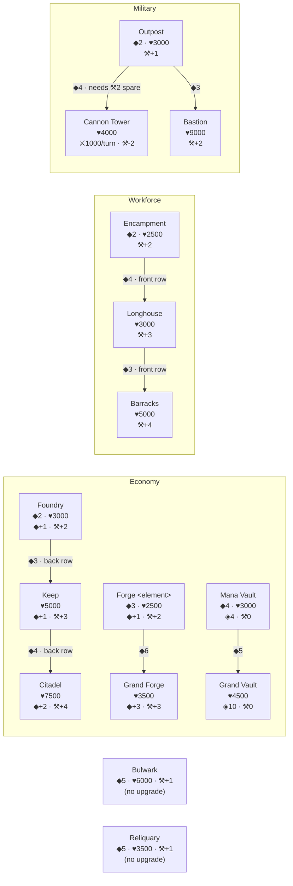

# 05 — Structures & In-Place Upgrades

**Subsystem spec for the Unity 6 / C# port of "Spawn Row Duel".**
Extracted from the JS source, which is the only existing specification.
Every rule below was read out of the code; presentation and browser workarounds are marked as such.

Primary source: `src/js/07_structures.js`
Catalogue source: `src/js/03_cards_creatures.js:30-79`
Support/worker math: `src/js/05_board_state.js:44-91`
Build menu + tech tree: `src/js/06_mana_workers.js:187-228`
Upkeep effects: `src/js/17_turns_ai.js:1-41`

All line citations are `file:line` against the repo state at commit `8b90375`.

---

## 0. Executive summary (read this first)

* A **structure** is a board object with `kind === 'building'`. Structures are **not deck cards**.
  They are raised from a **commander build menu** by paying generic mana ◆, gated by a **prerequisite
  tech tree** (`prereq`) — `src/js/03_cards_creatures.js:30-34`, `src/js/06_mana_workers.js:198`.
* There are **13 fixed structure definitions** plus **2 element-parameterised families**
  (Forge, Grand Forge — one variant per element, 9 elements) = **13 + 18 = 31 distinct structure
  identities**, of which **10 entries are buildable from the menu for a mono-element commander**
  and **12 for a dual-element commander** (one Forge + one Grand Forge per element).
* Structures **never move, never attack, never block, and never retaliate**. They exist to
  (a) generate mana, (b) raise the row's worker figure (`sup`), (c) cap mana carry-over (vaults),
  (d) shoot creatures (Cannon Tower), (e) return dead creatures to hand (Reliquary), (f) soak damage.
* **Upgrading** replaces a structure's stat block **in place**: same object identity, same tile,
  same owner, same banked ◆, **damage carried through**, cost = the full price of the new tier.
  Some tiers **branch** (Outpost → Cannon Tower *or* Bastion).
* `bidLineage` walks the `from` chain so an upgraded tier still satisfies the tech-tree prerequisites
  its base unlocked (a Keep still counts as a Foundry) — `src/js/06_mana_workers.js:191`.
* **Mana Vaults** set the amount of unspent mana that survives the end-of-turn drain. They are
  ordinary attackable structures ("un-retired raid targets"), i.e. the enemy can raze your economy.
* The **castle wall** (the player's life pool) is *not* a structure object at all — it is a virtual
  row with no slots. `eff:'wall'` structures (Bulwark/Bastion) are a **different, and currently
  mechanically inert, thing**. See §9. This is the single most important trap in this subsystem.

---

## 1. Board context (only what structures need)

| Constant | Value | Source |
|---|---|---|
| `C`, `SLOTS` | 7 columns per row | `src/js/01_core_defs.js:1` |
| `CENTER_LANES` | `[1,3,5]` — creature lanes in the shared center | `src/js/01_core_defs.js:2` |
| center structure slots | `0, 2, 4, 6` (the non-lane "flanks") | `src/js/01_core_defs.js:6-7` |
| `ROWS` | `['foeBack','foeFront','center','youFront','youBack']` | `src/js/05_board_state.js:4` |
| `BASE_COL` | 3 | `src/js/01_core_defs.js:4` |

Storage: `G.P.you.back[7]`, `G.P.you.front[7]`, `G.P.foe.back[7]`, `G.P.foe.front[7]`, and one
**shared** `G.center[7]` that can hold objects owned by either player
(`src/js/05_board_state.js:5-21`).

A structure may legally occupy: **your back row**, **your front row**, or a **center flank slot
(0/2/4/6)**. It can never be placed in an enemy row, and never in a center lane
(`src/js/06_mana_workers.js:221-223`, `src/js/13_input.js:43-48`, `src/js/12_render.js` `decorate` build branch).

At game start **no structures exist on the board at all** — `startGame` fills every row with `null`
and the only "keep" is the abstract life pool (`src/js/09_game_start.js:1-19`). There is no
starting Foundry; the very first build must be a Foundry (the only structure with an empty `prereq`).

---

## 2. Runtime object model

### 2.1 The building instance (`mkBld`) — `src/js/06_mana_workers.js:94`

```js
function mkBld(t,owner){return {kind:'building',id:uid++,owner,
  color:t.color||G.P[owner].color,nm:t.nm,h:t.h,maxh:t.h,c:t.c,
  eff:t.eff,val:t.val||0,sup:t.sup||0,ic:t.ic,art:t.art,bank:0,bid:t.bid||null};}
```

| Field | Type | Meaning | Notes |
|---|---|---|---|
| `kind` | `'building'` | discriminator | |
| `id` | int | unique, from the global `uid` counter | must survive serialization for MP |
| `owner` | `'you' \| 'foe'` | controller | the shared center holds both sides' objects, so **always filter by `owner`, never by which array it lives in** (`src/js/05_board_state.js:46`) |
| `color` | element id | **falls back to the owner's primary element when the def's `color` is null** | so a "colorless" Foundry built by a Fire player has `color:'fire'` |
| `nm` | string | display name | |
| `h` / `maxh` | int | current / max hit points | no healing or repair exists anywhere in the codebase |
| `c` | int | the mana cost that was paid for this tier | rewritten on upgrade |
| `eff` | effect enum (§4) | upkeep behaviour | |
| `val` | int | effect magnitude (mana/turn, damage, vault cap) | |
| `sup` | int | worker support contributed to its row (may be **negative**) | |
| `ic` | string | UI glyph | presentation |
| `art` | string (data-URI or path) | fallback art | presentation |
| `bank` | int | banked ◆ stored **on** this card | see §11 |
| `bid` | `StructId \| null` | which definition this instance is | **null for hand-played structures** (§12) — a null `bid` means the structure can never be upgraded (`src/js/07_structures.js:5`) |
| `cc` | bool (absent) | command-center flag | vestigial; see §13 |

### 2.2 The definition record (`STRUCT_DEFS` entry)

| Field | Meaning |
|---|---|
| `bid` | stable string id |
| `nm`, `desc`, `ic`, `art` | presentation |
| `c` | mana cost to build **and** to upgrade into |
| `h` | max HP of the tier |
| `eff`, `val`, `sup` | see §4 / §5 |
| `prereq` | array of `bid`s that must be present on your field to *build* it |
| `color` | element (`null` = neutral); only the Forge families set it |
| `up2` | array of `bid`s this tier can be upgraded **into** (branching = length > 1) |
| `from` | the `bid` this tier was upgraded **from**; marks an upgrade-only tier and drives `bidLineage` |
| `row` | `'back' \| 'front'` row gate — **checked on upgrade only, never on build** (§7.3) |

### 2.3 Suggested C# shapes

```csharp
public enum StructId { Foundry, Encampment, Longhouse, Vault, Bulwark, Outpost, Tower,
                       Reliquary, Keep, Citadel, Barracks, Bastion, GrandVault,
                       Forge, GrandForge }

public enum StructEffect { None, Mana, Villager, Vault, Wall, Damage, Revive, Command }

public enum RowGate { Any, Back, Front }

// Pure data. Backed by a ScriptableObject asset generated from the JS registry,
// but the rules core must consume the plain struct, not the SO.
public sealed record StructureDef(
    StructId       Id,
    string         DisplayName,
    int            Cost,
    int            MaxHp,
    StructEffect   Effect,
    int            EffectValue,
    int            Support,          // may be negative
    Element?       Element,          // null => neutral, instance inherits owner's primary
    StructId[]     Prereqs,
    StructId[]     UpgradeTargets,   // `up2`
    StructId?      UpgradedFrom,     // `from`
    RowGate        RowGate,
    string         Glyph,
    string         ArtKey,
    string         RulesText);

public sealed class StructureInstance : IBoardObject   // mutable runtime state
{
    public int        Id;            // uid
    public PlayerId   Owner;
    public Element    Element;       // resolved (never null)
    public StructId?  DefId;         // null => legacy hand-built, not upgradeable
    public string     Name;
    public int        Hp, MaxHp, Cost, EffectValue, Support;
    public StructEffect Effect;
    public int        Bank;
    public bool       IsCommandCenter; // always false in the shipped rules; see §13
}
```

`StructureCatalog.Resolve(StructId id, Element? color)` must reproduce `resolveStruct`
(`src/js/06_mana_workers.js:199`):

```js
function resolveStruct(bid,color){
  if(bid==='forge')return forgeDef(color);
  if(bid==='grandforge')return grandForgeDef(color);
  return STRUCT_DEFS[bid]||null; }
```

i.e. **Forge and Grand Forge are generated per element at lookup time**; every other id is a
singleton record. A C# implementation should either pre-generate all 9 forge variants per family
at load (18 records) or keep a `(StructId, Element)` keyed factory. **Do not** flatten forges into
9 distinct `StructId` values — the whole tech tree keys off the shared id `forge` / `grandforge`
(`prereq:['forge']`, `hasBuild(owner,'forge')`).

---

## 3. The full structure catalogue

### 3.1 Buildable-from-menu tiers — `src/js/03_cards_creatures.js:55-62`

| bid | Name | ◆ Cost | ♥ HP | eff | val | sup | Glyph | prereq | color | up2 | row gate |
|---|---|---:|---:|---|---:|---:|:--:|---|---|---|---|
| `foundry` | The Foundry | 2 | 3000 | `mana` | 1 | +2 | ⚒ | — | null | `keep` | — |
| `encampment` | Encampment | 2 | 2500 | `none` | 0 | +2 | ⛺ | `foundry` | null | `longhouse` | — |
| `longhouse` | Longhouse | 4 | 3000 | `villager` | 0 | +3 | ⌂ | `foundry` | null | `barracks` | `front` * |
| `vault` | Mana Vault | 4 | 3000 | `vault` | 4 | 0 | ◈ | `foundry` | null | `grandvault` | — |
| `outpost` | Outpost | 2 | 3000 | `none` | 0 | +1 | ⛨ | `forge` | null | `tower`, `bastion` | — |
| `bulwark` | Bulwark | 5 | 6000 | `wall` | 0 | +1 | ▣ | `forge` | null | — | — |
| `tower` | Cannon Tower | 4 | 4000 | `damage` | **1000** | **−2** | ⤢ | `forge` | null | — | — |
| `reliquary` | Reliquary | 5 | 3500 | `revive` | 0 | +1 | ☩ | `longhouse` | null | — | — |
| `forge` | *see 3.3* | 3 | 2500 | `mana` | 1 | +2 | ⛭ | `foundry` | element | `grandforge` | — |
| `grandforge` | Grand *…* | 6 | 3500 | `mana` | 3 | +3 | ⛭ | `forge` | element | — | — |

\* `longhouse.row === 'front'` exists in the data but **`canBuild` never reads `row`** — you may
build a Longhouse in your back row. The gate only fires when a Longhouse is reached *by upgrading*
an Encampment (§7.3). Preserve this exactly, or change it deliberately and record the change.

### 3.2 Upgrade-only tiers — `src/js/03_cards_creatures.js:64-68`, `:71`

| bid | Name | ◆ Cost | ♥ HP | eff | val | sup | Glyph | from | up2 | row gate |
|---|---|---:|---:|---|---:|---:|:--:|---|---|---|
| `keep` | Keep | 3 | 5000 | `mana` | 1 | +3 | ♜ | `foundry` | `citadel` | **back** |
| `citadel` | Citadel | 4 | 7500 | `mana` | 2 | +4 | ♛ | `keep` | — | **back** |
| `barracks` | Barracks | 3 | 5000 | `villager` | 0 | +4 | ⚔ | `longhouse` | — | **front** |
| `bastion` | Bastion | 3 | 9000 | `wall` | 0 | +2 | ▣ | `outpost` | — | — |
| `grandvault` | Grand Vault | 5 | 4500 | `vault` | **10** | 0 | ◈ | `vault` | — | — |
| `grandforge` | Grand *…* | 6 | 3500 | `mana` | 3 | +3 | ⛭ | `forge` | — | — |

`grandforge` appears in **both** tables: it carries `from:'forge'` (so it is an upgrade target and
inherits forge lineage) **and** it is pushed into the build menu by `buildList`
(`src/js/03_cards_creatures.js:77`), so it can also be raised from scratch on a fresh tile for ◆6
provided you already own any Forge. `tower` and `bastion` are similar in spirit but only `tower` is
in the build menu; `bastion` is upgrade-only.

All upgrade-only tiers have `prereq: []` — the prerequisite check is not applied to upgrades at all
(§7.2).

### 3.3 The Forge family — `src/js/03_cards_creatures.js:23`, `:70-71`

`forgeDef(el)` / `grandForgeDef(el)` build the record; the name comes from `FORGE_NAMES`:

| Element | Forge name (◆3, ♥2500, ◆+1/turn, ⚒+2) | Grand Forge name (◆6, ♥3500, ◆+3/turn, ⚒+3) |
|---|---|---|
| fire | Emberforge | Grand Emberforge |
| water | Tidewell | Grand Tidewell |
| earth | Stonewell | Grand Stonewell |
| wind | Galewell | Grand Galewell |
| forest | Thornwell | Grand Thornwell |
| electric | Stormforge | Grand Stormforge |
| light | Dawnwell | Grand Dawnwell |
| dark | Gloomwell | Grand Gloomwell |
| divine | Empyreum | Grand Empyreum (unreachable — Divine is not a commander element) |

The Grand tier name is literally `'Grand '+FORGE_NAMES[el]` (`src/js/03_cards_creatures.js:71`).

### 3.4 The per-commander build list — `src/js/03_cards_creatures.js:73-79`

```js
function buildList(ccId){
  const cols=ccColors(ccId), out=[STRUCT_DEFS.foundry];
  cols.forEach(el=>out.push(forgeDef(el)));
  out.push(STRUCT_DEFS.encampment, STRUCT_DEFS.longhouse, STRUCT_DEFS.vault,
           STRUCT_DEFS.outpost, STRUCT_DEFS.bulwark, STRUCT_DEFS.tower, STRUCT_DEFS.reliquary);
  cols.forEach(el=>out.push(grandForgeDef(el)));
  return out; }
```

**Order is load-bearing** — it is both the menu display order and the AI's build priority (§14).
A mono-element commander sees 10 entries; a dual-element commander sees 12 (one Forge and one Grand
Forge per element). `ccColors` comes from the leader subsystem (`src/js/06_mana_workers.js:46`).

---

## 4. Structure effects (`eff`)

The `eff` string is a **single-valued** enum. Behaviour lives in `buildingUpkeep`
(`src/js/17_turns_ai.js:2-11`), `rowWorkers` (`src/js/05_board_state.js:61-68`) and
`vaultCap` (`src/js/17_turns_ai.js:33`).

| `eff` | Structures | Mechanical behaviour | Where |
|---|---|---|---|
| `mana` | Foundry, Keep, Citadel, Forge, Grand Forge | At the **start of its owner's turn**: `P.mana = min(99, P.mana + val)`. Fires once per structure. | `src/js/17_turns_ai.js:5` |
| `damage` | Cannon Tower | At the start of its owner's turn: deal `val` (1000) to the **nearest enemy creature** (see §4.1). | `src/js/17_turns_ai.js:6`, `:25-31` |
| `revive` | Reliquary | At the start of its owner's turn: return the **most recently graved non-token creature** to the owner's hand. **Once per turn regardless of how many Reliquaries you own.** | `src/js/17_turns_ai.js:7`, `:13-23` |
| `vault` | Mana Vault, Grand Vault | Contributes `val` to the owner's **mana-retention cap** at end of turn (§8). No upkeep tick. | `src/js/17_turns_ai.js:33-36` |
| `villager` | Longhouse, Barracks | Adds `val` to its row's worker figure (`rowWorkers`). **`val` is 0 for both structures, so this effect currently contributes nothing** — their entire worker contribution comes from `sup`. | `src/js/05_board_state.js:64` |
| `wall` | Bulwark, Bastion | **No mechanical effect whatsoever.** Nothing in the codebase branches on `eff==='wall'` except UI text. See §9. | — |
| `none` | Encampment, Outpost | No effect; pure `sup` + HP. | — |
| `command` | (command-center object only) | Vestigial; never constructed in the shipped flow. §13. | `src/js/04_cards_leaders.js:24` |

### 4.1 Cannon Tower targeting — `src/js/17_turns_ai.js:25-31`

```
buildingDamage(owner, val, name):
  1. if val <= 0: return
  2. foe := the other player
  3. for w in ['front','center','back']:                 # note this exact order
       arr := (w == 'center') ? G.center : G.P[foe][w]
       for x in arr (slot 0..6 ascending):
         if x != null and x.owner == foe and x.kind == 'creature' and not x.worker:
            target := x; break out of both loops
  4. if target: target.h -= val   (log)
```

* Targets **only creatures**, never structures, never worker minions, never the life pool.
* Worker minions (`worker === true`) are explicitly skipped.
* Columns and rows are otherwise irrelevant — first match in `front → center → back`, slot order.
* Deaths are swept by `cleanup()` immediately after `buildingUpkeep` in `startTurn`
  (`src/js/17_turns_ai.js:57`).
* Multiple Cannon Towers each fire independently, in the `buildingUpkeep` iteration order (§4.3).

### 4.2 Reliquary revive — `src/js/17_turns_ai.js:13-23`

```
reviveFromGrave(owner):
  scan owner's graveyard from the END (most recent) toward the front
  first record with type == 'creature' and not token:
     splice it out of the graveyard
     push a fresh handcard {kind:'handcard', id:uid++, type:'creature',
        color: rec.color || owner's primary, nm, a, h, c, fs, up, art,
        kw, det, ward, wardhp, reap, grow, hatch, into, entrench, tribe, subtype}
     return true
  return false
```

Note `h` on the grave record is the creature's **max** HP (`toGrave` stores `obj.maxh ?? obj.h`,
`src/js/07_structures.js:69`), so the returned card is undamaged. Worker minions are graved with
`type:'villager'` and are therefore never revived. Structures are graved with `type:'building'` and
are never revived either.

### 4.3 Upkeep iteration order (determinism-critical) — `src/js/17_turns_ai.js:9-10`

```js
['front','back'].forEach(w=>P[w].forEach(tick));      // front slots 0..6, then back slots 0..6
G.center.forEach(o=>{ if(o&&o.owner===owner) tick(o); });   // then center slots 0..6
```

Mana adds are commutative, but the `revived` latch and the Cannon Tower firing order are not.
Reproduce this order exactly.

`buildingUpkeep` sits inside `startTurn` in this sequence (`src/js/17_turns_ai.js:49-71`):

1. `G.turnNo++`, set `G.turn`, clear `cardMenu` / `moveMana` / `decls`
2. `P.firstExtract = true`; `P.upaid = {back:0,front:0,center:0,raid:0}`
3. reset every own creature's `sick / tapped / moved / moved2 / paid / blocked / _dis`
4. `chrysalisUpkeep(owner)`
5. `overchargeUpkeep(owner)`
6. **`buildingUpkeep(owner)`** ← all structure upkeep effects
7. `cleanup()` — sweeps anything the tower killed
8. `syncWorkers(owner)` — rebuild worker pools from the cards now on the board
9. `readyWorkers(owner)` — un-sick / un-tap the workers so they can harvest
10. phase → `upkeep` (human) or AI draw + `aiFixDeficit` + `readyWorkers`

---

## 5. Support (`sup`) and the worker economy

Workers are **not units and are not trained**. Each row's worker count is a *derived figure*:
Σ(structure support in that row) − Σ(creature upkeep in that row), plus a per-row constant in the
back row. `src/js/05_board_state.js:51-68`.

### 5.1 `rowWorkers` — `src/js/05_board_state.js:61-68`

```
rowWorkers(owner, zone):
  s := 0
  for each global row key in zoneKeys(owner, zone):
     for each object o in that row (slots 0..6):
        if o == null or o.owner != owner: continue
        if o.kind == 'building':  s += o.sup + (o.eff == 'villager' ? o.val : 0)
        elif o.kind == 'creature' and not o.worker: s -= o.up
  if zone == 'back': s += CCS[G.P[owner].cc].wk      # commander's base workers
  return s
```

Zones (`src/js/05_board_state.js:56-60`):

| zone | global rows read | notes |
|---|---|---|
| `back` | your back row | + commander `wk` (2 or 3 for solo elements; `round((a+b)/2)` for duals) |
| `front` | your front row | |
| `center` | the shared center row (your objects only) | |
| `raid` | **both** enemy rows (`foeFront`, `foeBack` for `you`) | you can never have structures there, so this figure is only ever ≤ 0 |

*Only `back`/`front`/`center` produce worker pools; `raid` is a pure liability zone
(`src/js/05_board_state.js:69`, `:72`).*

### 5.2 `syncWorkers` — `src/js/05_board_state.js:71-78`

```
syncWorkers(owner):
  for zone in [back, front, center]:
     target := max(0, rowWorkers(owner, zone))
     pool := G.P[owner].min[zone]
     while pool.Count > target: pool.RemoveLast()          # excess workers vanish, no grave record
     while pool.Count < target: pool.Add(newWorker{sick=true})
```

New workers enter **summoning-sick**, so a structure raised mid-turn does not harvest that turn.
`readyWorkers` (`src/js/05_board_state.js:81`) clears `sick/tapped/moved` for all pools, and runs
**only at turn start**, after `syncWorkers`.

`syncWorkers(owner)` is invoked after every board mutation that could change support:
`afterDeploy` (`src/js/06_mana_workers.js:23`), `placeBuild` → `afterDeploy`
(`src/js/06_mana_workers.js:227`), `upgradeStruct` (`src/js/07_structures.js:30`),
`aiBuild`/`aiUpgrade` (`src/js/07_structures.js:43`, `:61`), `flip` (`src/js/14_spells_traps.js:125`),
`doMove` (`src/js/16_movement.js:55`), `upkeepSac` (`src/js/17_turns_ai.js:143`), and inside
`startTurn`. **It is NOT called from `cleanup()`** — when a structure is razed mid-combat the worker
pools stay stale until the next `syncWorkers`/`startTurn`. Reproduce or fix deliberately.

### 5.3 Negative support and the upkeep shortfall

* A structure with **negative `sup`** (only the Cannon Tower, `sup:-2`) *consumes* workers.
* `placeRowOK(owner, which, def)` (`src/js/06_mana_workers.js:196`) forbids building a negative-`sup`
  structure into a row that would go below zero:
  `def.sup >= 0 || (rowWorkers(owner, which) + def.sup) >= 0`.
* Creatures also subtract (`up`, their upkeep). A row whose figure goes negative creates a
  **deficit** that must be settled at upkeep — Move, Pay ◆, or Sacrifice a creature
  (`src/js/17_turns_ai.js:85-174`).
* If a row's shortfall is caused purely by structures (e.g. a Cannon Tower whose supporting Forge
  was razed) there is nothing to move or sacrifice; `orphanDeficit` (`src/js/17_turns_ai.js:103-107`)
  detects that and lets ⛏ Harvest pay it out of the harvest proceeds instead of dead-locking the
  turn (`src/js/17_turns_ai.js:162-169`). An unpayable remainder simply goes unpaid.

### 5.4 Dead code — do not port

`workerCap`, `structSupport`, `monsterUpkeep` (`src/js/05_board_state.js:47-50`), `enforceCap`,
`canTrain`, `minionCount` (`src/js/06_mana_workers.js:12-22`) and `trainVillager`
(`src/js/14_spells_traps.js:128-133`) are from the **previous** worker model. `enforceCap` and
`trainVillager` are never called from any live path (verified by grep across `src/js`). `structuresOf`
survives only as a HUD counter (`src/js/12_render.js:10`).

---

## 6. Building a structure

### 6.1 Legality — `src/js/06_mana_workers.js:192-198`

```js
hasBuild(owner,bid)   = ownBuildings(owner).some(b => bidLineage(b).includes(bid))
prereqMet(owner,def)  = def.prereq.every(p => hasBuild(owner,p))
placeRowOK(owner,w,d) = d.sup >= 0 || (rowWorkers(owner,w) + d.sup) >= 0
hasPlacement(owner,d) = ['back','front','center'].some(w =>
                            cellArr(owner,w).some(x => !x) && placeRowOK(owner,w,d))
canBuild(owner,def)   = manaTotal(owner) >= def.c && prereqMet(owner,def) && hasPlacement(owner,def)
```

Notes:

* `ownBuildings` **excludes** command-center-flagged objects (`src/js/06_mana_workers.js:188`).
* `prereq` matching uses **lineage**, so a Keep satisfies `foundry`, a Grand Emberforge satisfies
  `forge`, a Barracks satisfies `longhouse`, a Bastion satisfies `outpost`. See §7.5 for the one
  tier where this breaks (`tower`).
* `prereq:['forge']` is satisfied by **any element's** forge. Colour never gates a build cost —
  mana is fully generic (`src/js/06_mana_workers.js:1-10`).
* `hasPlacement` scans `center` via `cellArr(owner,'center') === G.center`, and **does not exclude
  the lanes**, so `canBuild` can report "placeable" when the only free center cells are lanes. The
  actual placement step re-checks and rejects (`src/js/06_mana_workers.js:222`). Harmless in the JS
  (worst case a "no legal slot" dead end), but a C# `CanBuild` used for AI planning should exclude
  lanes properly.
* **There is no per-structure build cap for the human player.** You may raise unlimited Foundries,
  Vaults, Towers etc. Only mana, prerequisites, and free slots limit you. (The AI self-caps — §14.)

### 6.2 Placement — `placeBuild`, `src/js/06_mana_workers.js:221-227`

```
placeBuild(which, slot):                       # which ∈ {back, front, center}
  def := G.build                               # the pending selection; abort if null
  1. if which == 'center' and isLane(slot):    reject ("build on the dark flanking slots")
  2. if cell occupied  OR  not placeRowOK(you, which, def):  reject
  3. if not canBuild(you, def):                cancel silently (mana/prereq changed)
  4. payAny('you', def.c)                      # deducts min(mana, cost) — cost already verified
  5. cellArr('you', which)[slot] = mkBld(def, 'you')
  6. log; G.build = null; afterDeploy('you')   # -> syncWorkers
  7. defaultHint(); render(); checkWin()
```

The build flow is: `openBuildMenu()` → `drawBuild()` renders one row per `buildList` entry with a
disabled reason (`src/js/06_mana_workers.js:200-215`) → `buildPick(bid,color)` resolves the def,
stores it in `G.build`, closes the panel and switches the board into placement mode
(`src/js/06_mana_workers.js:217-219`) → the next board tap calls `placeBuild`
(`src/js/13_input.js:103-106`).

Disabled reasons rendered in the menu (`src/js/06_mana_workers.js:206`), in priority order:

1. `needs <a Foundry|a Forge|a Longhouse|an Encampment|an Outpost>` (missing prereq)
2. `need ◆<cost>`
3. `no row with ⚒ to spare` (negative-`sup` def with no legal row) or `no open space`

**Cost is paid at placement, not at menu selection.** Cancelling (`cancelBuild`) refunds nothing
because nothing was charged.

### 6.3 Drag-and-drop parity (presentation)

`src/js/31_ui_shell.js:224-235` lets a *hand* card be dragged; `card.type==='building'` maps to
mode `'build'`. Since no structures exist in any deck (§12), that branch is currently unreachable.
The build-menu flow has no drag path — it is tap/click select-then-place.

---

## 7. In-place upgrades

Header comment, `src/js/07_structures.js:1-3`:

> STRUCTURE UPGRADES: level a built structure up IN PLACE (keeps its tile + stored ◆), following its
> `up2` chain. Row-gated tiers (Keep/Citadel back, Barracks front) enforce the RTS "line lives in
> that row" feel. Branching (Outpost → Cannon Tower | Bastion) just lists more than one target.

### 7.1 Enumerating targets — `src/js/07_structures.js:4-8`

```js
function upgradeTargets(o){
  if(!o || o.kind!=='building' || o.cc || !o.bid) return [];
  const src = resolveStruct(o.bid, o.color);
  const ids = (src && src.up2) || [];
  return ids.map(bid => resolveStruct(bid, o.color)).filter(Boolean);
}
```

* A structure with a null `bid` (hand-played, §12) has **no upgrade path at all**.
* The **instance's own colour** is passed down, so an Emberforge upgrades to a *Grand Emberforge*
  and never to another element's Grand Forge.
* Order of the returned list = the `up2` array order = the button order in the UI and the AI's
  branch preference. For `outpost` that is **`['tower','bastion']`** — Cannon Tower first.

### 7.2 Legality — `src/js/07_structures.js:9-15`

```js
function upgradeWhy(owner,o,key,def){
  if(def.row && whichOf(key)!==def.row)
      return def.row==='back' ? 'only in your back row' : 'only in your front row';
  if(manaTotal(owner) < def.c) return 'need ◆'+def.c;
  if((def.sup||0)<0 && (rowWorkers(owner,whichOf(key)) - (o.sup||0) + (def.sup||0)) < 0)
      return 'row has no ⚒ to spare';
  return '';
}
function canUpgradeTo(owner,o,key,def){ return !!def && upgradeWhy(owner,o,key,def)===''; }
```

Three gates, in this order (the first failing gate is the message shown):

1. **Row gate.** `whichOf(key)` yields `'center' | 'front' | 'back'` (`src/js/15_combat.js:3`).
   A row-gated tier can therefore **never** be reached in the center.
2. **Mana.** Full price of the target tier; no discount for the base already paid.
3. **Row worker headroom** — only when the target has negative `sup`. The formula removes the
   structure's *current* support first, then adds the target's:
   `rowWorkers − o.sup + def.sup ≥ 0`.
   Worked example: Outpost (`sup +1`) → Cannon Tower (`sup −2`) in a row currently at ⚒4:
   `4 − 1 + (−2) = 1 ≥ 0` → allowed, and the row ends at ⚒1.
   In a row at ⚒2: `2 − 1 − 2 = −1` → rejected with "row has no ⚒ to spare".

**Prerequisites are NOT checked on upgrade.** Razing your Foundry does not stop you upgrading an
existing Keep into a Citadel. This is intentional-looking (all upgrade-only tiers ship `prereq:[]`)
but note it explicitly.

### 7.3 Which upgrades are row-gated

| Upgrade | Gate | Effect in practice |
|---|---|---|
| Foundry → Keep | `back` | must be standing in your back row |
| Keep → Citadel | `back` | " |
| Encampment → Longhouse | `front` | " (front) |
| Longhouse → Barracks | `front` | " |
| Outpost → Cannon Tower | none | any row incl. center flank |
| Outpost → Bastion | none | any row incl. center flank |
| Vault → Grand Vault | none | any |
| Forge → Grand Forge | none | any |

### 7.4 Applying the upgrade — `src/js/07_structures.js:16-22`

```js
function applyUpgrade(o,def){
  o.bid=def.bid; o.nm=def.nm; o.eff=def.eff; o.val=def.val||0; o.sup=def.sup||0; o.ic=def.ic;
  const dmg=Math.max(0,(o.maxh??def.h)-o.h);   // upgrading repairs NOTHING
  o.maxh=def.h; o.h=Math.max(1,def.h-dmg);     // it gains only the new tier's extra max HP
  o.c=def.c; o.art=def.art;
  if(def.color) o.color=def.color;
}
```

**Preserved (never touched):** the object identity (`id`), `kind`, `owner`, `bank` (stored ◆),
its board cell (row + column), and — when `def.color` is null — its `color`.

**Replaced:** `bid`, `nm`, `eff`, `val`, `sup`, `ic`, `maxh`, `c`, `art`, and `color` when the
target def carries one (Forge → Grand Forge keeps the element because both defs set it).

**Damage carries through.** Accumulated damage `dmg = maxh − h` is recomputed against the new max:
`h = max(1, newMax − dmg)`.

Worked examples:

| Before | Upgrade | After |
|---|---|---|
| Foundry ♥3000/3000 | → Keep (max 5000) | ♥5000/5000 |
| Foundry ♥1200/3000 (1800 damage) | → Keep | ♥3200/5000 |
| Outpost ♥200/3000 (2800 damage) | → Cannon Tower (max 4000) | ♥1200/4000 |
| Outpost ♥100/3000 (2900 damage) | → Bastion (max 9000) | ♥6100/9000 |
| hypothetical: 5000 damage → tier with max 4000 | | clamped to ♥1 (the `max(1, …)` floor) |

Because every tier's max HP is ≥ its predecessor's in the shipped data, the ♥1 floor never fires
today — but keep it, it is the only thing preventing an upgrade from killing its own structure.

Structures have **no summoning sickness, tapped, moved or blocked flags at all** — none of those
fields exist on a building instance, so "what does an upgrade do to sickness?" has the answer
*nothing to do*. A structure's upkeep effect is evaluated only in `startTurn(owner)`, so a structure
built or upgraded during your Action phase **first fires at the start of your next turn** — there is
no "enters tapped / enters sick" concept for buildings, just the turn boundary. (The workers it adds
are separately sick until the next `readyWorkers`, §5.2.)

### 7.5 `bidLineage` and prerequisite tracking — `src/js/06_mana_workers.js:189-192`

```js
// a structure's tier lineage: its own bid plus every base it was UPGRADED from (via `from`), so an
// upgraded tier still satisfies tech-tree prereqs its base unlocked (e.g. Keep still counts as a Foundry).
function bidLineage(b){ const out=[]; let cur=b&&b.bid, g=0;
  while(cur && g++<8){ out.push(cur); const d=resolveStruct(cur,b.color); cur=d&&d.from; }
  return out; }
function hasBuild(owner,bid){ return ownBuildings(owner).some(b=>bidLineage(b).indexOf(bid)>=0); }
```

Guard: at most 8 hops (cycle protection). Lineages in the shipped data:

| Instance bid | `bidLineage` |
|---|---|
| `foundry` | `[foundry]` |
| `keep` | `[keep, foundry]` |
| `citadel` | `[citadel, keep, foundry]` |
| `encampment` | `[encampment]` |
| `longhouse` | `[longhouse]` — **note: no `from`, so it does *not* inherit `encampment`** |
| `barracks` | `[barracks, longhouse]` |
| `vault` | `[vault]` |
| `grandvault` | `[grandvault, vault]` |
| `outpost` | `[outpost]` |
| `bastion` | `[bastion, outpost]` |
| `tower` | `[tower]` — **`tower` has no `from`, so an upgraded Outpost loses its Outpost lineage** |
| `forge` | `[forge]` |
| `grandforge` | `[grandforge, forge]` |
| `bulwark`, `reliquary` | `[bulwark]`, `[reliquary]` |

Consequences to preserve (or consciously fix):

* Upgrading your only Outpost into a **Cannon Tower** erases `outpost` from your lineage set. No
  prerequisite reads `outpost` today, so this only affects the AI's build cap (§14) — the AI will
  happily build a fresh Outpost afterwards. Upgrading into a **Bastion** keeps the lineage.
* A **Longhouse reached by upgrading an Encampment** does not count as an Encampment, which is
  irrelevant (nothing requires `encampment`), but it *does* count as a `longhouse`, which is what
  the Reliquary needs.
* `bidLineage` passes `b.color` into `resolveStruct` on every hop. Since only forges use colour,
  and forge lineage is colour-consistent, this is safe. In C#, keep the colour on the walk.

### 7.6 Player-driven upgrade command — `src/js/07_structures.js:23-31`

```
upgradeStruct(rowKey, slotIndex, targetBid):
  1. require acting()            # G.turn=='you' && !G.busy && !G.over && G.phase=='action'
  2. o := rowArr(rowKey)[slotIndex]
     require o && o.kind=='building' && o.owner=='you' && !o.cc
  3. def := upgradeTargets(o).find(d => d.bid == targetBid)   # rejects targets not in this tier's up2
     if !def: return silently
  4. if !canUpgradeTo('you', o, rowKey, def):
        setHint("Can't upgrade to <def.nm> — <upgradeWhy(...)>"); render(); return
  5. payAny('you', def.c)
  6. applyUpgrade(o, def)
  7. log "You upgrade <old name> into a <new name>."
  8. G.cardMenu = null; syncWorkers('you'); afterDeploy('you')   # afterDeploy calls syncWorkers again
  9. defaultHint(); render(); checkWin()
```

UI entry point: tapping your own structure opens a card menu whose buttons are one per upgrade
target, each labelled `⬆ <Name> ◆<cost>` and disabled with the `upgradeWhy` string as tooltip
(`src/js/13_input.js:126-137`). The inspect panel appends
`⬆ Upgrades to: <Name> (◆cost, back row) · …` (`src/js/18_inspect_viewers.js:91-92`).

There is **no confirmation step and no undo**. Upgrading is instant and costs no action/tap budget:
a player may upgrade any number of structures per turn as long as mana allows.

`buildingLoc(owner, unit)` (`src/js/07_structures.js:33-36`) resolves a placed unit's `{key, i}` by
scanning `back → front → center`; used by the AI which holds object references rather than coords.

### 7.7 The full upgrade graph



Tabular form (source of truth for the implementer):

| From | ◆ | To | Branch? | Row gate | Extra gate |
|---|---:|---|---|---|---|
| Foundry | 3 | Keep | no | back | — |
| Keep | 4 | Citadel | no | back | — |
| Encampment | 4 | Longhouse | no | front | — |
| Longhouse | 3 | Barracks | no | front | — |
| Mana Vault | 5 | Grand Vault | no | — | — |
| Forge *(el)* | 6 | Grand Forge *(el)* | no | — | — |
| Outpost | 4 | Cannon Tower | **yes (1/2)** | — | row must keep ⚒ ≥ 0 after `−sup +(−2)` |
| Outpost | 3 | Bastion | **yes (2/2)** | — | — |
| Bulwark, Cannon Tower, Bastion, Citadel, Barracks, Grand Vault, Grand Forge, Reliquary | — | *(terminal)* | | | |

Cheapest full economy chain: Foundry ◆2 → Keep ◆3 → Citadel ◆4 = **◆9 total** for a ♥7500 /
◆+2-per-turn / ⚒+4 back-row anchor, versus ◆2 for a bare Foundry (♥3000 / ◆+1 / ⚒+2).

---

## 8. Mana Vaults

Mana is a **single generic pool per player** (`P.mana`), capped at 99 in-turn
(`src/js/06_mana_workers.js:5-8`, `src/js/16_movement.js:184`). It **fully drains at the end of the
owner's turn** except for what the vaults hold.

```js
function vaultCap(owner){                                     // src/js/17_turns_ai.js:33
  return ownUnits(owner).filter(o=>o.kind==='building'&&o.eff==='vault')
                        .reduce((s,o)=>s+(o.val||0),0); }
function drainMana(owner){                                    // :34-36
  const P=G.P[owner], cap=vaultCap(owner), lost=Math.max(0,P.mana-cap);
  P.mana=Math.min(P.mana,cap); return {keep:P.mana,lost}; }
```

* Vault capacities **stack additively** across all your vaults, anywhere on the board (own rows +
  center flanks). Three Mana Vaults = ◈12; a Grand Vault + a Mana Vault = ◈14.
* `endTurnDrain(owner)` runs at the end of every turn: player `endTurn`
  (`src/js/17_turns_ai.js:232`), AI `foeTurn` (`src/js/17_turns_ai.js:388`), MP end intent
  (`src/js/42_mp_apply.js:264`).
* Vault upgrade path: **Mana Vault (◈4, ◆4, ♥3000) → Grand Vault (◈10, ◆5, ♥4500)**.
  Both have `sup: 0` — vaults contribute **no workers at all**, the only structures that don't.
* **"Un-retired raid targets":** vaults are ordinary structures with HP. They can be attacked,
  burned (1500/2000 spell damage), razed outright by a `raze` spell, or destroyed by a Wind Scour
  strike if they sit in the back row. Destroying a vault immediately lowers `vaultCap`, so a raid
  that lands *before* the victim's end-of-turn drain also destroys the mana it would have kept.
* The retained mana is what funds the "pay to stay" upkeep settlement (`upkeepPay`,
  `src/js/17_turns_ai.js:127-137`) at the start of the next turn — vault mana is the only mana that
  exists *before* the harvest.
* HUD (presentation): `manaStr` shows `◆<mana>` plus a `◈<cap>` chip when `vaultCap > 0`
  (`src/js/12_render.js:2-5`).

---

## 9. Walls, the castle wall, and `eff:'wall'` — READ CAREFULLY

There are **three unrelated things** that the source calls "wall". Do not merge them.

**(a) The castle wall / life pool.** Not an object. Each player has `P.life` (initial value =
commander HP, 10000 for every element — `src/js/01_core_defs.js:16-25`, `src/js/09_game_start.js:2-3`).
It is attacked as a *virtual row* one index beyond the defender's back row
(`tIdx = -1` beyond `foeBack`, `tIdx = ROWS.length` beyond `youBack` —
`src/js/15_combat.js:4-11`, `src/js/16_movement.js:91-113`). Because the strike crosses **every**
real row on the way, defenders in those rows may interpose; a strike launched from inside the
defender's own back row cannot be intercepted at all. When `P.life` hits 0 that player loses
(`checkWin`, `src/js/17_turns_ai.js:392-407`). **No structure protects the life pool, and structures
are not consumed when it is hit.**

**(b) `eff:'wall'` structures — Bulwark and Bastion.** The flavour text claims
"it can intercept and be raided" (`src/js/03_cards_creatures.js:59`,
`src/js/18_inspect_viewers.js:24`). **Interception is not implemented for structures.**
`untappedInterceptors` collects only `c.kind === 'creature'` board objects plus worker minions
(`src/js/15_combat.js:15-19`). Grepping the tree, nothing branches on `eff === 'wall'` except three
presentation strings (`src/js/12_render.js:151`, `src/js/13_input.js:84`,
`src/js/18_inspect_viewers.js:24`). So today a Bulwark is exactly "◆5 for a ♥6000 body worth ⚒+1"
and a Bastion is "◆3 upgrade for a ♥9000 body worth ⚒+2". They are the toughest objects in the game
and nothing more.
**Port decision required** (see Open Questions): ship the inert version faithfully, or implement
structure blocking. If you implement it, the hook is `untappedInterceptors` and the blocked-flag
bookkeeping — note that a structure has no `blocked`/`tapped` fields, and `resolveCombat`'s
retaliation model assumes blockers deal `b.a` damage back (structures have no `a`).

**(c) The UI "castle wall" panels.** `body.wall-open` / `foewall-open` DOM classes, the deck and
graveyard piles rendered "in the wall" (`src/js/12_render.js:34-58`). Pure presentation.

---

## 10. How structures take damage and die

### 10.1 Damage sources

| Source | Effect on a structure | Where |
|---|---|---|
| Declared attack (Combat v3) | `applyDmg(focusFire([attacker],[structure]))` — the structure takes the attacker's effective ⚔ and **deals no damage back** | `src/js/15_combat.js:350-352` |
| Legacy single-shot attack (MP path) | same, via `doAttack` | `src/js/16_movement.js:81` |
| AI attack | same | `src/js/17_turns_ai.js:373-374` |
| `burn` spell (Ember Bolt / Frost Lance / Cinder Volley 1500, Searing Brand 2000) | `o.h -= card.val` | `src/js/14_spells_traps.js:6-8`, target legality `src/js/13_input.js:57` |
| `raze` spell (Cave-In, Dissolve, Topple the Spire — ◆3) | **destroyed outright**, straight to grave, no damage step | `src/js/14_spells_traps.js:9-11` |
| Wind `scour` on-hit | picks the defender's back row: first face-down `charge`/`trap`, else **first non-CC building** → sets `h = 0` (instant destruction regardless of HP) | `src/js/06_mana_workers.js:164-173` |
| `detonate` death trigger | if the dying creature's controller has no live enemy *creature*, it hits the **lowest-HP enemy structure** for `det` | `src/js/06_mana_workers.js:125-129` |
| Cannon Tower | **never** hits structures | `src/js/17_turns_ai.js:28-29` |
| Trap `burn` (Backlash) / `pitfall` (Snare Pit…) | attackers/creatures only, never structures | `src/js/15_combat.js:105-106` |
| Played over (own structure holding ◆) | the occupant is graved to make room | `src/js/13_input.js:185-205` |

Structures are always legal attack targets: while an attack group is held, **every** enemy field
object gets the `target` class and columns never matter (`src/js/12_render.js` `decorate`,
`src/js/13_input.js:165-168`). A structure is picked by the AI with `aiPickTarget`
(`src/js/17_turns_ai.js:262-263`): after lethal-creature options, the lowest-HP building with 30%
probability.

There is **no repair, regeneration or healing** for structures anywhere in the codebase, and
upgrading explicitly does not repair (§7.4).

### 10.2 Death — `cleanup()`, `src/js/16_movement.js:193-205`

```
cleanup():
  repeat (max 40 passes) until no change:
    for key in ROWS (foeBack, foeFront, center, youFront, youBack):
      for i in 0..6:
        c := row[i]
        if c and (c.kind=='creature' or c.kind=='building') and c.h <= 0:
           log "<Your|Their> <name> is razed."      # 'falls' for creatures
           row[i] = null
           if creature and not worker: onCreatureDeath(c, owner)
           toGrave(owner, c)
           mark changed
    for each player, for each pool in [back, front, center]:
       remove any worker with h <= 0 (toGrave)
```

* The re-sweep loop exists so chained kills (Detonate) resolve in one call.
* Removal is by the object's **own `owner` tag**, not by which row it sat in.
* **`cleanup()` does not call `syncWorkers`** — the razed structure's support disappears from
  `rowWorkers` immediately (it is derived), but the worker *pools* are not rebuilt until the next
  `syncWorkers` call. In practice the pools resync at the next turn start; a mid-turn raze can leave
  the visible worker pool larger than `rowWorkers` until then. Port note: this is observable
  (workers can still be harvested/blocked with in that window).

### 10.3 Graveyard record — `toGrave`, `src/js/07_structures.js:67-76`

```js
else if(obj.kind==='building')
  rec={type:'building',nm:obj.nm,h:obj.maxh??obj.h,c:obj.c,eff:obj.eff,val:obj.val,sup:obj.sup,ic:obj.ic};
G.P[owner].grave.push(rec);
```

Note what is **dropped**: `bid`, `color`, `art`, `bank`, current HP. The grave record stores **max**
HP. Banked ◆ on a destroyed structure is simply lost. Structures in the graveyard can never return
(`reviveFromGrave` only accepts `type:'creature'`), they only count toward the graveyard total and
appear in the graveyard viewer (`src/js/18_inspect_viewers.js:135-142`).

MP snapshot rehydration re-derives art from `bid` if present (`src/js/41_mp_sync.js:16-21`) —
another reason the C# instance must keep `DefId`.

---

## 11. Banked ◆ on structures

Any board object (creature or structure) may carry `bank`, a stash of ◆:

* Set when a face-down card is flipped with surplus investment: `bank = inv − cost`
  (`src/js/14_spells_traps.js:113-117`).
* Moved between your own board objects with `startSendMana` / `doSendMana`
  (`src/js/14_spells_traps.js:72-80`): the whole stack moves; destination must be your own
  creature or building.
* Spent by **playing a card on top** of the banked object (`src/js/13_input.js:185-205`): the
  occupant is destroyed (`toGrave`) and its bank pays toward the new card's cost, surplus carrying
  to the newcomer. This is legal only in your back/front rows, only for `summon`/`build` modes, and
  only when `occ.bank > 0`. **A structure holding ◆ can therefore be demolished by its owner to
  play something on its tile.**
* **`applyUpgrade` preserves `bank` untouched** — upgrading does not consume or refund it.
* Banked ◆ is **not** counted by `manaTotal` and cannot pay an upgrade or build cost directly; it
  must be Sent to the target card first, then spent by playing over it.
* Displayed as a `◆n` corner badge (`src/js/12_render.js:153`) and as an inspect chip
  (`src/js/18_inspect_viewers.js:89`).

---

## 12. Face-down and hand-played structures (legacy path)

The engine still supports a structure arriving from the **hand**:

* `place(idx, 'build', which, slot)` — pays `card.c`, creates `mkBld(card,'you')`
  (`src/js/13_input.js:207-211`). Because the hand card has **no `bid`**, the resulting structure
  is permanently un-upgradeable (`src/js/07_structures.js:5`).
* `place(idx, 'set', …)` — sets a **face-down `charge`** with `ctype:'building'`, ◆1 banked toward
  its cost (`src/js/13_input.js:226-234`). Flipping it (`flip`, `src/js/14_spells_traps.js:110-118`)
  creates the structure with `bank = inv − cost`, again with no `bid`.
* Attacking an under-funded face-down destroys it and the banked ◆ is lost; a funded one flips and,
  if it is a structure, "just takes the hit" (`provokeFaceDown`, `src/js/15_combat.js:87-99`).

**In the shipped content this path is unreachable:** `CARD_REG` is built from creature pools plus
neutral spells only — `for(const el of COLORS){ add(POOLS[el],'creature',el); }` with the comment
"creatures only — structures are built, not drawn" (`src/js/06_mana_workers.js:40`), and
`migrateDeckCards` drops any saved structure entries (`src/js/06_mana_workers.js:61`). There is no
`type:'building'` template in `POOLS` (verified by grep).

**Port recommendation:** keep the code path *shape* (a `StructureInstance` with `DefId == null`
must be legal and non-upgradeable) but do not build UI for it until a structure card is authored.
Every `type === 'building'` hand-card branch in `11_deck_builder.js`, `13_input.js`,
`18_inspect_viewers.js` and `12_render.js` is currently dead weight.

---

## 13. Command centers (vestigial)

`mkCC` (`src/js/04_cards_leaders.js:23-24`) builds a `{kind:'building', cc:true, eff:'command',
sup: def.wk}` object. **It is never called.** `findCC` returns `null` with the comment "command
centers removed — the back row itself is the stronghold (life pool)"
(`src/js/04_cards_leaders.js:25`), and `startGame` places no CC (`src/js/09_game_start.js`).

Nonetheless the `cc` flag is defensively checked in ~10 places and those checks define behaviour a
future CC would have:

* excluded from `ownBuildings` → does not satisfy prerequisites, not counted by AI caps
  (`src/js/06_mana_workers.js:188`)
* cannot be upgraded (`src/js/07_structures.js:5`, `:25`)
* cannot be targeted by any spell (`src/js/13_input.js:55`)
* cannot be built over (`src/js/13_input.js:186`)
* skipped by Scour's back-row shatter (`src/js/06_mana_workers.js:168`)
* triggers the AI's "defend the base" interception heuristic (`src/js/15_combat.js:73-78`)
* renders with a distinct gold `.ccx` card frame (`src/js/12_render.js:133-136`)

**Port as:** a boolean `IsCommandCenter` on `StructureInstance`, always false, with the guard
predicates implemented. Do not delete the concept — the campaign may want boss keeps.

---

## 14. AI behaviour

### 14.1 `aiBuild(owner)` — `src/js/07_structures.js:50-66`

Called from `foeTurn` as `if(aiBuild('foe')) aiBuild('foe');` — **up to two structures per turn**
(`src/js/17_turns_ai.js:285`).

```
aiBuild(owner):
  list := buildList(G.P[owner].cc)                 # priority order == menu order
  CAP  := {foundry:1, encampment:1, longhouse:1, vault:1, outpost:1, bulwark:1, tower:2, reliquary:1}
  for def in list:                                 # first affordable legal entry wins
    a) if CAP[def.bid] exists and
          count(ownBuildings(owner) where bidLineage(b) contains def.bid) >= CAP[def.bid]: skip
       # an upgraded tier still counts toward its base's cap (Keep counts as a foundry)
    b) if def.bid == 'forge' and any own building whose lineage contains 'forge' has b.color == def.color: skip
    c) if def.bid == 'grandforge' and any own building with b.bid == 'grandforge' and b.color == def.color: skip
    d) if not canBuild(owner, def): skip
    e) which := first of ['back','front'] with freeDeploySlot(owner,which) >= 0
                                        and placeRowOK(owner,which,def)          # AI never builds in the center
       if none: skip
    f) slot := aiPickDeploySlot(owner, which)
    g) payAny(owner, def.c); cellArr(owner,which)[slot] = mkBld(def,owner); syncWorkers(owner)
       log; return true
  return false
```

* `grandforge` and `grandvault`-style tiers have **no CAP entry**, so the only limiter on Grand
  Forges is rule (c) — one per element. Grand Vault is upgrade-only, never in the list.
* `aiPickDeploySlot` column preference (`src/js/16_movement.js:20-23`):
  front `[3,4,2,5,1,6,0]`, back `[2,4,3,1,5,0,6]`, center `[3,1,5]`.
* Caps count by lineage, so upgrading a Foundry to a Keep does **not** free the AI to build a second
  Foundry — but upgrading an Outpost to a Cannon Tower **does** free the Outpost slot (§7.5),
  and also frees a Tower slot only to the extent of `CAP.tower = 2`.

### 14.2 `aiUpgrade(owner)` — `src/js/07_structures.js:38-48`

Called once per AI turn, after the two build attempts (`src/js/17_turns_ai.js:286`).

```
aiUpgrade(owner):
  for b in ownBuildings(owner):                    # board scan order: ROWS x slots (see ownUnits)
    loc := buildingLoc(owner,b)                    # {key,i}; skip if not found
    def := first d in upgradeTargets(b) with canUpgradeTo(owner,b,loc.key,d)
    if none: continue
    payAny(owner, def.c); applyUpgrade(b,def); syncWorkers(owner); log; return true
  return false
```

* **One upgrade per AI turn, maximum.**
* Branch preference = `up2` order → **Cannon Tower before Bastion**, and only when the tower's
  worker gate passes; otherwise it falls through to Bastion.
* The scan order is `ownUnits` order: `foeBack, foeFront, center, youFront, youBack`, slots 0..6
  (`src/js/05_board_state.js:46`) — for the `foe` player that means its back row first.
* The AI never upgrades if it cannot pay; it never saves up for an upgrade.
* The AI's mana is banked/drained by the same vault rules, so an AI with vaults plays differently
  across turns. The AI has no vault-specific logic beyond `CAP.vault = 1`.

---

## 15. Multiplayer surface (for the deferred netcode layer)

Even though MP is deferred, the JS already models structures as **command/intent driven**, which is
the shape the C# core must keep.

| Intent | Payload | Host validation | Source |
|---|---|---|---|
| `build` | `{bid, color, w, i}` | re-resolves the def from the **host's** catalogue, rejects lanes, occupied slots, `!placeRowOK`, `!canBuild` | `src/js/42_mp_apply.js:176-187` |
| `upgrade` | `{k, i, bid, color}` | requires a foe-owned non-CC building at `(k,i)`, `bid` ∈ `upgradeTargets`, and `canUpgradeTo` | `src/js/42_mp_apply.js:189-197` |
| `place` (hand build/set) | `{idx, mode, w, i}` | mirrors `place`, incl. play-on-top and `centerSlotOK` | `src/js/42_mp_apply.js:74-142` |
| `sendmana` | `{fk,fi,tk,ti}` | both ends foe-owned, source has bank, dest is creature/building | `src/js/42_mp_apply.js:159-164` |

Guest-side capture wrappers: `placeBuild` (`src/js/43_mp_intents.js:83-90`) captures `G.build`
*before* the original clears it, and only emits the intent if the resulting cell holds a building
with the expected `bid`; `upgradeStruct` (`src/js/43_mp_intents.js:93-98`) emits only if the same
object's `bid` actually changed. **Design lesson for C#: every structure mutation must be verifiable
after the fact from `(object identity, DefId)`.**

Serialization: `MPSER.snapshot` deep-copies `G.P.*.front/back`, `G.center` and strips `art`;
`artFor` rebuilds a building's art from `rec.bid + rec.color` (`src/js/41_mp_sync.js:16-21`).
So `DefId` + `Element` must be enough to reconstruct all presentation.

---

## 16. Presentation-only behaviour (do NOT port as rules)

* Build panel HTML, disabled-button tooltips, `PRN` prerequisite phrasing
  (`src/js/06_mana_workers.js:200-219`).
* Structure card face: glyph, `◆+n` / `⚒train` / `⚔n` / `◈n` / `▣` / `☩` / `⌂` effect chip,
  `⚒+n` support chip (`src/js/12_render.js:149-155`).
* Standee sprites: every building gets `_fieldart` scaffolding; **structures never use the `laid`
  pose** (`src/js/12_render.js:168-179`).
* FX wrappers, which change no rules: `placeBuild` gets a construction ring/flash
  (`src/js/22_fx_wrappers.js:161-167`), `aiBuild` likewise (`:168-175`), `toGrave` plays
  `SFX.raze()` + shake for buildings (`:49-58`), `flip` plays a raise splash for buildings ≥ ◆4
  (`:112-121`). **No monkey-patch anywhere touches `upgradeStruct`, `applyUpgrade`, `upgradeTargets`,
  `canUpgradeTo`, `buildingUpkeep`, `vaultCap` or `rowWorkers`** (verified by reading
  `22_fx_wrappers.js` in full).
* Inspect text `bldEffectText` (`src/js/18_inspect_viewers.js:20-29`) — **note it disagrees with the
  code twice**: it claims a `villager` structure "trains a free Minion (0/2 ⚒) into its owner's base
  pool" (no such code path exists — §4) and that a `wall` structure "can intercept" (§9).
* Deck-builder building branches (`src/js/11_deck_builder.js:75-92`) — dead, structures are not
  deckable.

### Browser/DOM workarounds (irrelevant to Unity)

* `snapLegalCell` 44px tap-forgiveness snapping for the tilted board projection
  (`src/js/12_render.js`), `body.placing` ghosting of the hand, `elementFromPoint` quirks in extreme
  tilt mode. All input-layer compensation for a CSS-3D board; Unity should use real raycasts.
* `document.body.classList.remove('wall-open','foewall-open')` on mode choice
  (`src/js/13_input.js:32`) — phone layout, not a rule.

---

## 17. Known inconsistencies and bugs (decide explicitly before porting)

1. **`eff:'wall'` is inert.** Bulwark/Bastion do not intercept (§9). The rules text lies.
2. **`eff:'villager'` is inert.** Both `villager` structures ship `val: 0`, so the
   `+ (eff==='villager' ? val : 0)` term in `rowWorkers` always adds 0 (§4, §5.1).
   Longhouse/Barracks are pure `sup` structures.
3. **`longhouse.row = 'front'` is not enforced on build** — only on upgrade (§3.1, §7.3).
4. **`tower` has no `from`**, so upgrading an Outpost into a Cannon Tower erases the `outpost`
   lineage (§7.5). Bastion is the consistent case.
5. **`cleanup()` does not resync worker pools** (§10.2).
6. **`hasPlacement` counts center lanes as free slots** for structures (§6.1).
7. **`upgradeStruct` calls `syncWorkers` then `afterDeploy`, which calls `syncWorkers` again**
   (`src/js/07_structures.js:30`) — harmless, but do not treat the double call as meaningful.
8. **No structure cap for the human player** while the AI self-caps (§6.1, §14.1) — a balance
   asymmetry, not a bug per se.
9. **`payAny` can underpay.** `payAny(o,n)` deducts `min(P.mana, n)` and returns whether it covered
   the cost, but every structure call site ignores the return value
   (`src/js/06_mana_workers.js:8`, `src/js/07_structures.js:28`, `:43`, `:61`). It is safe only
   because the legality check ran first. In C#, make payment fail loudly instead.
10. **Dual-commander worker rounding:** `Math.round((a+b)/2)` on `.5` rounds **up** in JS;
    C# `Math.Round` uses banker's rounding and would give a different base worker count for
    fire+water (2.5 → JS 3, C# default 2). Use `MidpointRounding.AwayFromZero`
    (`src/js/04_cards_leaders.js:18`).

---

## 18. Determinism / netcode checklist for the C# core

* All structure logic is already pure state → state; **no randomness** appears in build, upgrade,
  upkeep, vault or death code. The only RNG near structures is `aiPickTarget`'s 30% chance to strike
  a building (`src/js/17_turns_ai.js:263`) and 60% to strike a funded face-down — that belongs to
  the AI layer and must run off a seeded, snapshot-serialised PRNG.
* Iteration orders that MUST be preserved verbatim: `buildingUpkeep` (§4.3), `buildingDamage` (§4.1),
  `cleanup` (§10.2), `ownUnits`/`ROWS` order (`src/js/05_board_state.js:46`), `buildList` (§3.4),
  `aiBuild`/`aiUpgrade` scans (§14).
* Commands to expose from the rules core (host-authoritative validation reuses the same predicates):

```csharp
public readonly record struct BuildStructureCommand(PlayerId Actor, StructId Def, Element? Color,
                                                    RowZone Zone, int Slot);
public readonly record struct UpgradeStructureCommand(PlayerId Actor, RowKey Row, int Slot, StructId Target);
public readonly record struct SendBankCommand(PlayerId Actor, RowKey From, int FromSlot, RowKey To, int ToSlot);

public enum BuildBlockReason { None, MissingPrereq, NotEnoughMana, NoOpenSlot, RowCannotSupport }
public enum UpgradeBlockReason { None, WrongRow, NotEnoughMana, RowCannotSupport, NotATarget, NotUpgradeable }
```

  Mirror `upgradeWhy` as an enum-returning `TryUpgrade` so the UI can render the same three
  messages without string parsing.
* Everything a structure needs to be reconstructed from a snapshot: `id, owner, defId, element, hp,
  maxHp, bank`. `nm/eff/val/sup/c/ic/art` are all recoverable from `defId + element` — consider
  storing only the recoverable-from-def subset and treating the instance as
  `(defId, element, hp, bank)`. **Exception:** legacy null-`bid` structures (§12) carry their stats
  inline and would need the full block; if you drop that path, the compact form is safe.

---

## 19. Open questions for the design owner

1. **Bulwark / Bastion:** implement structure blocking (making `eff:'wall'` real), or re-word the
   cards to match the inert behaviour? At ◆5 for ⚒+1 and no ability, Bulwark is currently a
   strictly worse Foundry/Encampment except as a damage sponge.
2. **Longhouse / Barracks:** was `eff:'villager'` meant to add workers on top of `sup` (i.e. give
   them a non-zero `val`), or is `sup` now the whole story and `villager` should be deleted?
3. **Cannon Tower lineage:** should `tower` gain `from: 'outpost'` for consistency with `bastion`?
4. **Repair:** is the total absence of structure healing intended? Upgrading explicitly preserves
   damage, which reads deliberate, but there is no other way to ever restore a structure's HP.
5. **Human build caps:** should the player be limited the way the AI is (1 Foundry, 1 Longhouse,
   2 Towers, one Forge per element)? Today nothing stops a Foundry spam opening.
6. **Center-flank structures:** the four center flank slots are shared between both players
   (first-come). Is a structure in the contested center supposed to be reachable/raidable the same
   way (it is — it is an ordinary enemy field object), and should it feed the `center` worker zone
   the way it currently does?
7. **Grand Forge dual role:** it is both a ◆6 from-scratch build and a ◆6 upgrade from a ◆3 Forge —
   i.e. going Forge → Grand Forge costs ◆9 total versus ◆6 direct, but the direct build still needs
   a Forge to exist as prerequisite. Intended?
